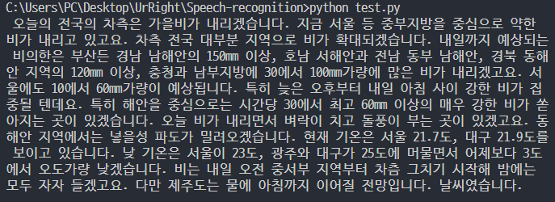

## 음성 인식

### 사용 오픈소스
- Whisper(base)  
>OpenAI에서 개발한 자동 음성 인식(Automatic Speech Recognition, ASR) 모델


---

### 실행전 설치

- [PyTorch](https://pytorch.org/) 1.10.1
- python 3.8 - 3.11
- The latest release of Whisper
  - ```pip install -U openai-whisper```
  - ```pip install git+https://github.com/openai/whisper.git```
  - ```pip install --upgrade --no-deps --force-reinstall git+https://github.com/openai/whisper.git```
##### NVIDIA
- CUDA11  
  - 각자 운영체제에 맞는거 설치 [[링크]](https://developer.nvidia.com/cuda-11.0-download-archive)

- cuDNN for CUDA11
  - CUDA 설치된 경로에 압축 풀어서 덮어쓰기  [[링크]](https://developer.nvidia.com/cuda-11.1.0-download-archive?target_os=Windows&target_arch=x86_64&target_version=10&target_type=exenetwork)
>위에 2개는 회원가입 필요..
##### PIP
- CMD ~/UrRight/Speech-recognition/ 경로상에서
    - ```pip install -r requirments.txt```
- ffmpeg를 설치하라고 할 땐
    - ```choco install ffmpeg```

---

### 실행 데모
```
C:~/Speech-recognition/demo python test.py
```

아나운서 날씨 예보 MP3 파일을 사용 [demo/audio.mp3]
- [날씨] 전국 차츰 비‥해안, 시간당 30~50mm↑ (2023.09.20/뉴스투데이/MBC)[[유튜브 원본 링크]](https://www.youtube.com/watch?v=fv5zt2mdFXM&t=2s&ab_channel=MBCNEWS)
#### 결과

