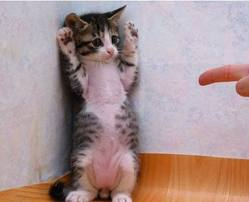

### Image-to-text result
----
### image1

- Discription : ['a cat laying on top of a pillow']

### image2

- Discription : ['a cat sitting on a wooden floor next to a wall']

### image3

- Discription : ['a white plate topped with two hot dogs on top of a wooden table']
